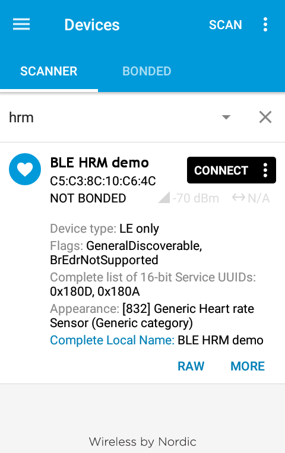
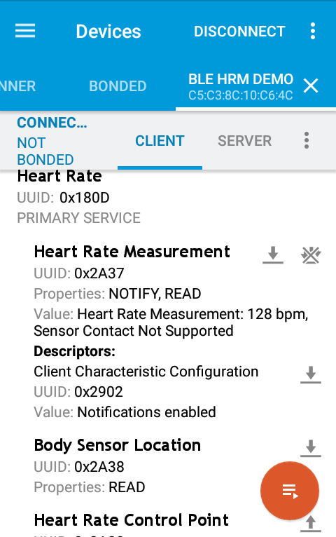
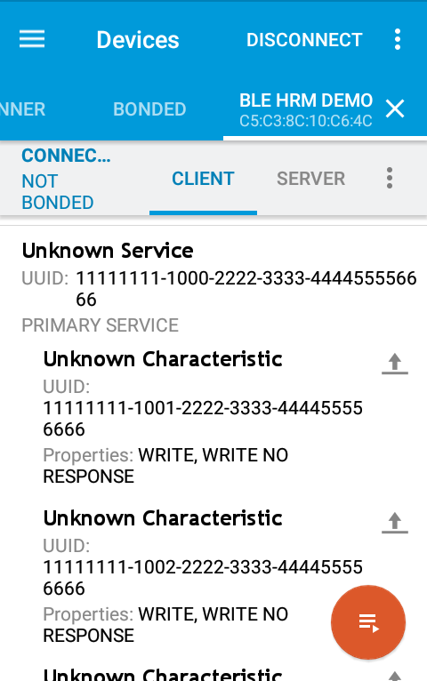
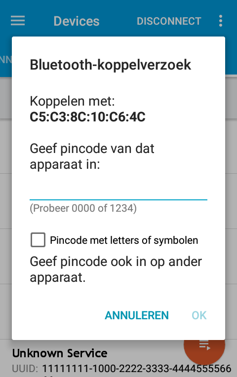

# Introduction to Bluetooth Low Energy
The purpose of this tutorial is to get you started with the basics of the nRF51 and Bluetooth Low Energy (BLE).

The requirement for this tutorial are:
- [Seeed Tiny BLE](http://wiki.seeed.cc/Tiny_BLE/) board
- [Mbed](https://os.mbed.com/) account
- smartphone with *nRF Connect for Mobile* app from Nordic Semiconductors
- terminal program, like PuTTY

Any other nRF51 might work as well. This tutorial will focus on the Seeed Tiny BLE board.

#### Table of Contents
- [Get up and running](#get-up-and-running)
- [Create a Heart Rate Monitor](#create-a-heart-rate-monitor)
- [Control the RGB-led](#control-the-rgb-led)
- [Bonding and security](#bonding-and-security)
- [Challenges](#challenges)


## Get up and running
Log in on the [Mbed](https://os.mbed.com) site, and open the **[compiler](https://os.mbed.com/compiler/#nav:/;)**. Import a new program from this repository.
Rigth click on *My Program* -> *Import Program ...* -> *From URL ...*. Enter as *Source URL*: https://github.com/pieterm/test2 and click on *Import*.

Now the Tiny BLE board has to be added to the Mbed compiler. [Add Seeed Tiny BLE board](https://os.mbed.com/platforms/Seeed-Tiny-BLE/add/) to your compiler.

### Create your own device
Open *main.cpp*. We will now change the device name, which will be used during advertisement. Find the device name and change this to something of your own choice. Remember that the name maximum length of the name is limited. The maximum length of the advertisement payload is 31 bytes. The maximum length available for the name is for now 15 bytes, which will be explained later.
```c
const static char DEVICE_NAME[] = "<CHANGE ME!>";
```
Now hit the **Compile** button and download the hex file. Connect the Tiny BLE board and copy the hex file to it.The RGB-LED should blink blue. Open the serial port of the Tiny BLE board with putty. You should see the following debug output (may need a reset):
```
Initialising the nRF51822
Initialized, running now
```

### Connect with the *nRF Connect* app
Open the *nRF Connect* app and hit the **Scan** button. You may enter a filter to make the list not too long. Hit the **connect** button.


As you can see, even before we have done anything, there are already two mandatory services set up for us:

The [Generic Access](https://www.bluetooth.com/specifications/gatt/viewer?attributeXmlFile=org.bluetooth.service.generic_access.xml) service, with UUID 0x1800. Three mandatory characteristics:
 1. Device name, UUID 0x2A00
 2. Appearance, UUID 0x2A01
 3. Peripheral Preferred Connection Parameters, UUID 0x2A04

The [Generic Attribute](https://www.bluetooth.com/specifications/gatt/viewer?attributeXmlFile=org.bluetooth.service.generic_attribute.xml) service with UUID 0x1801. One optional characteristics:
 1. Service changed, UUID 0x2A05

The Generic Access Service contains general information about the device. You can recognize a characteristic holding the device name "nRF5x". The second characteristic holds the appearance value with value **Generic Tag** (512). The third characteristic holds various parameters used to establish a connection. In the function `btle_gap_init()` (in file nRF51822/TARGET_MCU_NRF51822/source/btle/[btle_gap.cpp](https://os.mbed.com/teams/Nordic-Semiconductor/code/nRF51822/file/c90ae1400bf2/TARGET_MCU_NRF51822/source/btle/btle_gap.cpp/) line:45) these name, appearance and parameters are set. [Here](https://devzone.nordicsemi.com/f/nordic-q-a/28058/what-is-connection-parameters/110496#110496) is a short explanation regarding these parameters.

The second service is the Generic Attribute Service. Simply put, this service can be used to notify the central of changes made to the fundamental structure of services and characteristics on the peripheral. A short explanation can be found [here](https://devzone.nordicsemi.com/f/nordic-q-a/3477/changing-gatt-characteristic-properties).

## Create a Heart Rate Monitor
We are now going to expand the example by creating a heart rate monitor (HRM) Bluetooth device.

The Heart Rate Profile needs 2 services, according the Bluetooth GATT [specification](https://www.bluetooth.org/docman/handlers/downloaddoc.ashx?doc_id=239865).
1. Heart Rate Service
2. Device Information Service

### Step 1: Declare a service structure
First of all we need a place to store all data and information relevant to our services. The Bluetooth Core (see [HRP](https://www.bluetooth.com/specifications/gatt)) specificies the Heart Rate Profile must implement the Heart Rate Service and the Device Information Service. Declare two variables for each service one.
```c
HeartRateService         *hrService;
DeviceInformationService *deviceInfo;
```
These variable declarations needs the following header files, which should be added below the other `#include` instructions.
```c
#include "ble/services/HeartRateService.h"
#include "ble/services/DeviceInformationService.h"
```

### Step 2: Initialize the services
These 2 BLE service variables need to be initialized. This can be done in the `bleInitComplete()` function below the `/* setup service(s) */` comment.
```c
/* Setup primary service. */
hrService = new HeartRateService(ble, (uint8_t)100, HeartRateService::LOCATION_FINGER);
 
/* Setup auxiliary service. */
deviceInfo = new DeviceInformationService(ble, "Manufacturer1", "Model1", "SN1", "hw-rev1", "fw-rev1", "soft-rev1");
```
The Heart Rate Service needs an initial HRM counter value and the sensor's location. In this case 100 BPM and the sensor is located on the finger. The Device Information Service contains some information about the device, like manufacturer and version numbers.

### Step 3: Advertise as a Heart Rate Monitor
The advertisement packages could be updated to show that this device is a HRM. The appearance is now a **Generic tag**. The Bluetooth [GAP spec defines](https://www.bluetooth.com/specifications/gatt/viewer?attributeXmlFile=org.bluetooth.characteristic.gap.appearance.xml) several appearances, the *Heart rate sensor* appearances is 832. This should be added to the advertising payload in the `bleInitComplete()` function.
```c
ble.gap().accumulateAdvertisingPayload(GapAdvertisingData::GENERIC_HEART_RATE_SENSOR);
```

Also the used GATT services (HRS and DIS) could be advertised. Create an array with these used service UUIDs, just below the declaration of the *DEVICE_NAME*.
```c
static const uint16_t uuid16_list[]        = {GattService::UUID_HEART_RATE_SERVICE, 
                                              GattService::UUID_DEVICE_INFORMATION_SERVICE};
```

These define UUIDs should also be added in the advertising payload in the `bleInitComplete()` function.
```c
ble.gap().accumulateAdvertisingPayload(GapAdvertisingData::COMPLETE_LIST_16BIT_SERVICE_IDS, 
                                        (uint8_t *)uuid16_list, sizeof(uuid16_list));
```
The following screenshot shows the advertisement message, with the information we add in the advertising payload.


When we check the raw advertising data we will see the following:

| Length       | Type           | Data |
| ------------ | -------------- | ---- |
| 2            | flags (0x01)   | 0x06 |
| 5            | complete list 16bits service IDs (0x03)   | 0x0D180A18 |
| 3            | appearance (0x19)   | 0x4003 |
| 14           | complete local name (0x09)   | 0x424C452048524D2064656D6F00 |

*Lenght* is the length in bytes of the *type* and *data* fields. The total length of each row in bytes = the size of *Length* (1 byte) + the value of *Length*.
The size of the advertisement PDU in the above message is 1 + 2 + 1 + 5 + 1 + 3 + 1 + 14 = 28 bytes.

The maximum size of the name can be calculated: 31 bytes advertisement PDU - 3 bytes (1 + 2 flags) - 6 bytes (1 + 5 UUIDs) - 4 bytes (1 + 3 appearance) - 1 byte *Length* field for the name - 1 byte *type* (0x09 for the name) - 1 byte (0x00 as end of the name string) = 15 bytes.

### Step 4: Update the Heart Rate Measurement value
The heart rate measurement value could be read when connected, and shows 100 bpm. However, this value is static and will not change.

Because there is no real heart rate sensor on the board we can simulate one. This could be done by increasing a variable on a certain inteval and write the updated value to the Heart Rate Measurements characteristic.
Create 2 variables, one for the *hrm* value, the other for the time interval.
```c
bool timerTriggered = false;
uint8_t hrmCounter = 100;   // start with 100 bps
```
In the `periodicCallback()` function the timerTriggered variable must be set, to indicate that the characteristic must be updated. It is not safe to update the characteristic in this interrupt function, as this takes too long and some functions to the SoftDevice can only be called from outside interrupt context.
```c
timerTriggered = true;
```
Now in the main-loop the characteristic can be updated. Update the characteristic only when there is an active connection. Write the following code instead of the `ble.waitForEvent()` line in the main-loop.
```c
if (timerTriggered && ble.gap().getState().connected)
{
    timerTriggered = false; // reset the timer flag

    hrmCounter++;
    if (hrmCounter == 175)  // 100 <= HRM bps <= 175
    {
        hrmCounter = 100;
    }

    hrService->updateHeartRate(hrmCounter);
}
else
{
    ble.waitForEvent(); // low power wait for event
}
```
In the *nRF Connect* app hit the notify button (3 arrows down icon) on the *Heart Rate Measurement* characteristic. This will enable notifies from the board. The value of the *Heart Rate Measuremen* characteristic should increase every second.



## Control the RGB-led
The HRM profile uses service which are defined by the Bluetooth SIG-group. For a custom device a custom 128-bit UUID must be used instead of the 16-bit UUIDs. To show this we will create a custom service with 3 characteristics to control each color of the RGB-led on the board. 

### Step 5: Create custom UUIDs
First we muts create custom UUIDs for the custom service with accompanying characteristics. An UUID can be generated by for example [this](https://www.uuidgenerator.net/) online tool. An example is
```
11111111-1234-2222-3333-444455556666
```
For each characteristic we have to create an 16-bit number and place this into the `1234`-part of the example above.

| UUID | Description |
| --- | --- |
| 11111111-1000-2222-3333-444455556666 | custom RGB service |
| 11111111-1001-2222-3333-444455556666 | R-LED characteristic |
| 11111111-1002-2222-3333-444455556666 | G-LED characteristic |
| 11111111-1003-2222-3333-444455556666 | B-LED characteristic |

### Step 6: Declare the custom service structure
First the UUIDs must be declared. Also the GATT service and 3 characteristics must be declared.
```c
UUID uuidRgbService("11111111-1000-2222-3333-444455556666");
UUID uuidRCharacteristic("11111111-1001-2222-3333-444455556666");
UUID uuidGCharacteristic("11111111-1002-2222-3333-444455556666");
UUID uuidBCharacteristic("11111111-1003-2222-3333-444455556666");
GattService *rgbService;
GattCharacteristic *rgbCharTable[3];    // for each RGB-LED a separate characteristic
```

### Step 7: Initialize the custom service 
Create a characteristic for each LED, and add them to the service. This service must be added to the BLE stack. 
```c
/* Setup custom service */
rgbCharTable[0] = new GattCharacteristic(uuidRCharacteristic, NULL, 1, 1, 
        GattCharacteristic::BLE_GATT_CHAR_PROPERTIES_WRITE_WITHOUT_RESPONSE | GattCharacteristic::BLE_GATT_CHAR_PROPERTIES_WRITE);
rgbCharTable[1] = new GattCharacteristic(uuidGCharacteristic, NULL, 1, 1, 
        GattCharacteristic::BLE_GATT_CHAR_PROPERTIES_WRITE_WITHOUT_RESPONSE | GattCharacteristic::BLE_GATT_CHAR_PROPERTIES_WRITE);
rgbCharTable[2] = new GattCharacteristic(uuidBCharacteristic, NULL, 1, 1, 
        GattCharacteristic::BLE_GATT_CHAR_PROPERTIES_WRITE_WITHOUT_RESPONSE | GattCharacteristic::BLE_GATT_CHAR_PROPERTIES_WRITE);
    
rgbService = new GattService(uuidRgbService, rgbCharTable, sizeof(rgbCharTable) / sizeof(GattCharacteristic *));
ble.gattServer().addService(*rgbService);
```
Each characteristic has its own UUID. The `NULL` argument could hold a pointer to the initial value. But as this is a write-only characteristic we don't have any initial value. The next 2 arguments `1, 1` are the size in bytes of the *length* and *max length* of the characteristic. We just use 1 byte length. The following argument shows the characteristic can be written with and without response.



### Step 8: Add callback function on data written event
We could now write some data to our board, but this data is not yet handled. Therefor we have to create a callback function which will handle the written data. Add this into the `bleInitComplete()` function.
```c
ble.gattServer().onDataWritten(onDataWritten);
```
Create the callback function.
```c
void onDataWritten(const GattWriteCallbackParams *context)
{
    LOG("Data written, handle: 0x%04x \n", context->handle);
}
```
After writing a byte to each of the characteristics, the debug output will show something like:
```
Data written, handle: 0x0023 
Data written, handle: 0x0025 
Data written, handle: 0x0027
```

### Step 9: Handle data written in the callback function
This function is called each time a characteristic is written. The `handle` element of the parameter of the callback function is the handle of the characteristic which is written. Also write actions to other characteristics (for example the Heart Rate service) are handled here. We want to handle here only the write actions to the characteristics of the RGB-led. So we have to compare it with the handles of these characteristics.
```c
int value = *context->data;

if (context->handle == rgbCharTable[0]->getValueHandle())
{
    // the R-led
    ledRed = (value & 0x01);
}
else if (context->handle == rgbCharTable[1]->getValueHandle())
{
    // the G-led
    ledGreen = (value & 0x01);
}
else if (context->handle == rgbCharTable[2]->getValueHandle())
{
    // the B-led
    ledBlue = (value & 0x01);
}
```
Change the color of the RGB-led by writing a byte with value 1 (off) or 0 (on).

## Bonding and security
Pairing and bonding is not supported now. It can be requested by the *nRF Connect* app, but will fail due to the lack of implementation. In this part we are going to extend the demo with security functionality.

### Step 10: Init the security manager
The security manager must be initialized before it can be used. The security manager needs the following arguments
- `enableBonding` to indicate whether we need bonding or not
- `requireMITM` if we need Man In The Middle attack measures
- `iocaps` with the I/O capabilities of the board. 

The I/O capabilities could one of the following
- display only
- display and yes/no entry
- keyboard only
- no I/O capabilities
- keyboard and display

Our board can use the debug output to show something (the passkey) to the user, so we could select the *display only* option. Initialize the security manager in the `bleInitComplete()` function, with bonding enabled (first argument) and MITM protection required (second argument).
```c
/* Initialize the BLE security manager */
ble.securityManager().init(true, true, SecurityManager::IO_CAPS_DISPLAY_ONLY);
```

### Step 11: Show the passkey on request
We have indicated that our board has I/O capabilities. For this we need to implement a callback function. Add the callback handler to the security manager in the `bleInitComplete()` function.
```c
ble.securityManager().onPasskeyDisplay(passkeyDisplayCallback);
```
And create the callback function to show the passkey to the user.
```c
void passkeyDisplayCallback(Gap::Handle_t handle, const SecurityManager::Passkey_t passkey)
{
    int i;
    
    LOG("Input passkey: ");
    for (i = 0; i < SecurityManager::PASSKEY_LEN; i++)
    {
        LOG("%c ", passkey[i]);
    }
    LOG("\n");
}
```

### Step 12: Bond with the board
Connect with the *nRF Connect* app to the board. As you can see, we can read and write to all characteristics without having to enter the passkey. If we ask the app to bond with the board, the following message is shown in the debug output.
```
Input passkey: 4 5 3 1 1 5
```
Note that for every time another key is shown.

The app will ask for the passkey, as shown in the next image.



After entering the correct passkey, the *nRF Connect* app is bonded with the board. And after connecting the next time the passkey doesn't have to be entered again.

### Step 13: Force security on characteristics
Before we manually set up the bonding procedure, we are able to read and write from all characteristics. So bonding is not needed to communicate with the board. Add the following code in the `bleInitComplete()` function, before creating the `new GattService`.
```c
/* Require security to read or write characteristics */
rgbCharTable[0]->requireSecurity(SecurityManager::SECURITY_MODE_ENCRYPTION_WITH_MITM);
```
`SECURITY_MODE_ENCRYPTION_WITH_MITM` is the maximum security we can use now, as the S130 v1.0.0 SoftDevice uses Bluetooth v4.1. This value is translated into security mode 1, level 3. See [this link](https://stackoverflow.com/questions/38963836/bluetooth-low-energy-gatt-security-levels) for more explanation about the mode and levels.

Writing or reading from any of the HRM characteristics or writing to the *G-led* or *B-led* characteristics will succeed without having to enter the passkey. But on writing the *R-led* characteristic the passkey must be given, as expected.

### Step 14: Request security on connection
To request the security directly after the connection is established, we can request authentication to the GAP Central. The Central will encrypt the link, or pair and bond the device.

In the `connectionCallback()` function add the following code.
```c
// check if we have a secure connection
BLE &ble = BLE::Instance(BLE::DEFAULT_INSTANCE);
SecurityManager::LinkSecurityStatus_t secStatus;
ble.securityManager().getLinkSecurity(params->handle, &secStatus);
LOG("  current security status = %d\n", secStatus);
if (secStatus == SecurityManager::NOT_ENCRYPTED)
{
    // force encryption
    LOG("set link security\n");
    ble.securityManager().setLinkSecurity(params->handle, SecurityManager::SECURITY_MODE_ENCRYPTION_NO_MITM);
}
```
The security mode we request here is `SECURITY_MODE_ENCRYPTION_NO_MITM`, as this is the only option which is implemented. The Central can decide to choose another security mode. To check the security mode we can implement a callback function. Add the following code in the `bleInitComplete()` function.
```c
ble.securityManager().onSecuritySetupCompleted(securitySetupCompletedCallback);
ble.securityManager().onSecuritySetupInitiated(securitySetupInitiatedCallback);
ble.securityManager().onLinkSecured(linkSecuredCallback);
```
And add the callback functions.
```c
void securitySetupCompletedCallback(Gap::Handle_t handle, SecurityManager::SecurityCompletionStatus_t status)
{
    if (status == SecurityManager::SEC_STATUS_SUCCESS)
    {
        LOG("Security completed\n");
    }
    else
    {
        LOG("Security failed\n");
    }
}

void securitySetupInitiatedCallback(Gap::Handle_t handle, bool allowBonding, bool requireMITM, SecurityManager::SecurityIOCapabilities_t iocaps)
{
    LOG("security initiated for link %d\n", handle);
    LOG("   bonding = %d, require MITM = %d, IO caps = %d\n", allowBonding, requireMITM, iocaps);
}

void linkSecuredCallback(Gap::Handle_t handle, SecurityManager::SecurityMode_t securityMode)
{
    LOG("link %d secured with mode %d ", handle, securityMode);
    switch (securityMode)
    {
        case SecurityManager::SECURITY_MODE_NO_ACCESS:
            LOG("(SECURITY_MODE_NO_ACCESS)");
            break;
        case SecurityManager::SECURITY_MODE_ENCRYPTION_OPEN_LINK:
            LOG("(SECURITY_MODE_ENCRYPTION_OPEN_LINK)");
            break;
        case SecurityManager::SECURITY_MODE_ENCRYPTION_NO_MITM:
            LOG("(SECURITY_MODE_ENCRYPTION_NO_MITM)");
            break;
        case SecurityManager::SECURITY_MODE_ENCRYPTION_WITH_MITM:
            LOG("(SECURITY_MODE_ENCRYPTION_WITH_MITM)");
            break;
        case SecurityManager::SECURITY_MODE_SIGNED_NO_MITM:
            LOG("(SECURITY_MODE_SIGNED_NO_MITM)");
            break;
        case SecurityManager::SECURITY_MODE_SIGNED_WITH_MITM:
            LOG("(SECURITY_MODE_SIGNED_WITH_MITM)");
            break;
        default:
            LOG("(unknown mode)");
            break;
    }
    LOG("\n");
}
```
The debug output will show something like this.
```
Initialising the nRF51822
Initialized, running now
Connected
  current security status = 0
set link security
security initiated for link 3
   bonding = 1, require MITM = 1, IO caps = 4
Input passkey: 1 0 8 8 0 2 
link 3 secured with mode 3 (SECURITY_MODE_ENCRYPTION_WITH_MITM)
Security completed
```
As we can see the security mode is with MITM protection. 

## Challenges
**Challenge 1**: After [step 3](#step-3-advertise-as-a-heart-rate-monitor) the name is advertised. See what happens when you use a name with a length > 15 bytes.

**Challenge 2**: In [step 7](#step-7-initialize-the-custom-service) a custom 128-bit UUID is added to our BLE device. It can be usefull to advertise also the custom 128-bit UUID. This will not fit anymore in the advertisement payload. We can use the scan request and scan response for this. Use `accumulateScanResponse()` to show this complete custom 128-bit UUID during the advertisement.

